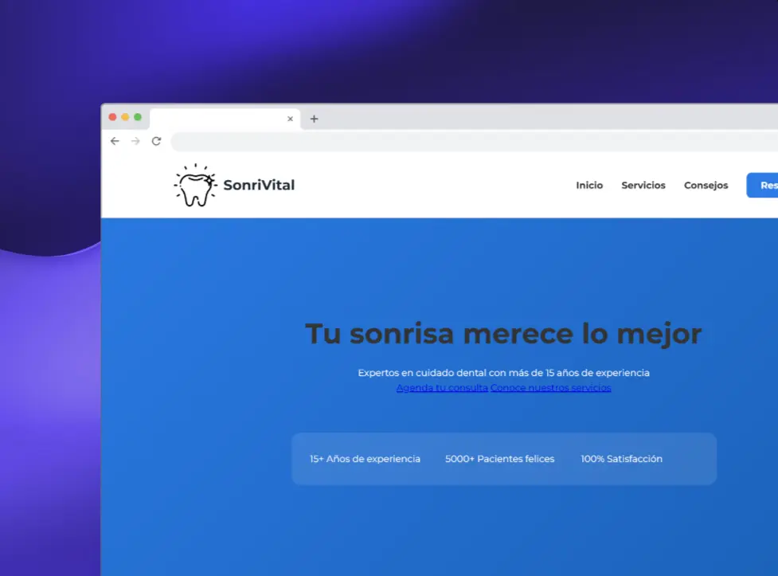

#  SonriVital - Clínica Dental Website



## Descripción del Proyecto

SonriVital es una landing page moderna y responsiva para una clínica dental, diseñada para proporcionar una experiencia de usuario óptima y facilitar la conexión entre pacientes y servicios dentales.

## Tecnologías Utilizadas

- HTML5
- CSS3
- JavaScript (para interacciones)
- Google Fonts (Montserrat)

## Estructura del Proyecto

``` notes
sonri-vital/
├── index.html
├── README.md
├── CNAME
└── static/
    ├── images/
    │   ├── icons/
    │   ├── logo/
    │   └── services/
    └── styles/
        └── style.css
```

## Secciones Principales

### 1. Navegación

- Menú responsivo con enlaces a todas las secciones
- Logo personalizado
- Botón CTA para reserva de citas
- Diseño adaptable para dispositivos móviles

### 2. Hero Section

- Mensaje principal atractivo
- Estadísticas clave de la clínica
- Botones de llamada a la acción
- Diseño con gradiente moderno

### 3. Servicios

- Tarjetas de servicios interactivas
- Información detallada de cada servicio
- Precios y duración de tratamientos
- Efectos hover para mejor interacción

### 4. Consejos de Higiene Dental

- Carrusel interactivo de consejos
- Tablas informativas
- Iconos ilustrativos
- Botones para ver más detalles

### 5. Contacto

- Información de contacto
- Ubicación
- Teléfono
- Correo electrónico

### 6. Footer

- Horarios de atención
- Enlaces a redes sociales
- Información de contacto adicional
- Derechos reservados

## Características Responsivas

- Diseño mobile-first
- Breakpoints para diferentes dispositivos:
  - Mobile Small (320px - 424px)
  - Mobile Large (425px - 767px)
  - Tablet (768px - 1024px)
  - Desktop (1025px+)
  - High-resolution screens (1440px+)

## Optimizaciones de UX/UI

- Paleta de colores profesional y coherente
- Tipografía legible (Montserrat)
- Animaciones suaves
- Feedback visual en interacciones
- Contraste adecuado para accesibilidad

## Variables CSS Personalizadas

```css
:root {
    --primary-color: #2C7BE5;
    --secondary-color: #6B7280;
    --accent-color: #10B981;
    --background-light: #F9FAFB;
    --text-dark: #1F2937;
    --text-light: #4B5563;
    --white: #FFFFFF;
    --shadow-sm: 0 2px 4px rgba(0, 0, 0, 0.05);
    --shadow-md: 0 4px 6px rgba(0, 0, 0, 0.1);
    --shadow-lg: 0 10px 15px rgba(0, 0, 0, 0.1);
    --transition: all 0.3s ease;
    --border-radius: 1rem;
    --text-font: 'Montserrat',sans-serif;
}
```

## Instalación y Uso

1. Clonar el repositorio
2. Asegurarse de tener todas las imágenes en las carpetas correspondientes
3. Abrir `index.html` en un navegador web moderno

## Mantenimiento

- Actualizar regularmente las imágenes de servicios
- Mantener la información de contacto actualizada
- Revisar y actualizar los consejos de higiene dental
- Verificar los enlaces a redes sociales

## SEO y Rendimiento

- Metaetiquetas optimizadas
- Imágenes optimizadas
- Estructura HTML semántica
- Tiempos de carga optimizados

## Créditos

Desarrollado por: @sandovaldavid

## Licencia

Todos los derechos reservados © 2023 SonriVital
